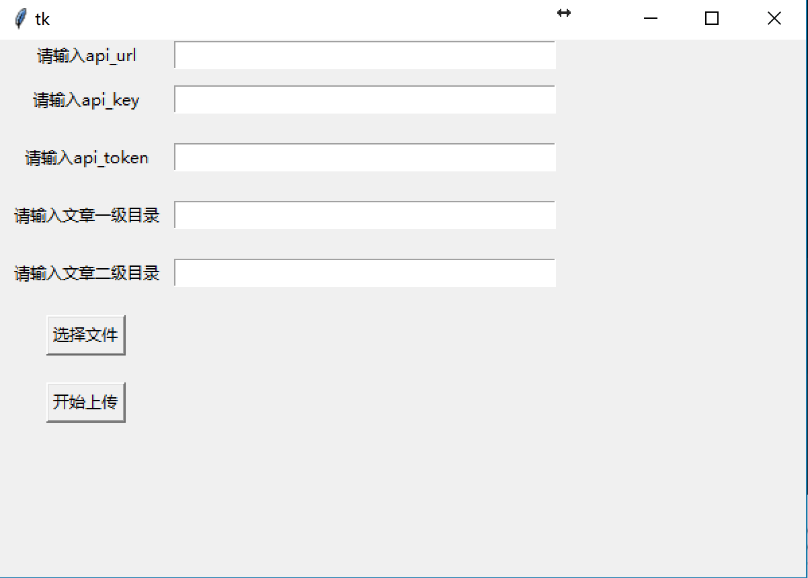

# MrFiona的个人showdoc使用总结

本文主要介绍关于showdoc的一些个人使用总结。

---

[TOC]

---

## Docke方式安装

### 基础安装

安装前请确保你的环境已经装好了docker。docker的安装教程在网上比较多，可以搜索了解下。这里重点介绍showdoc.、
```
#从国内镜像安装showdoc
docker pull registry.docker-cn.com/star7th/showdoc
#若上面方式安装失败，可尝试从docker国外官方镜像安装
# docker pull star7th/showdoc
#新建存放showdoc数据的目录
mkdir /showdoc_data
mkdir /showdoc_data/html
#启动showdoc容器。启动完了后别忘记后面还有转移数据的步骤。
docker run -d --name showdoc -p 4999:80 -v /showdoc_data/html:/var/www/html/ registry.docker-cn.com/star7th/showdoc
#转移数据 将容器内的/showdoc_data/html目录下的数据转移到/var/www/目录下
docker exec showdoc \cp -fr /showdoc_data/html/ /var/www/
# 权限
chmod 777 -R /showdoc_data

```

根据以上命令操作的话，往后showdoc的数据都会存放在 /showdoc_data/html 目录下。
你可以打开 http://xxx.com:4999 来访问showdoc (xxx.com为你的服务器域名或者IP)。账户密码是showdoc/123456，登录后你便可以看到右上方的管理后台入口。建议登录后修改密码。

### 如何升级

这里的升级是针对上面docker安装方式的升级。如果你原来是采用非docker安装方式（如php安装方式）的话，请跳过本部分文字，直接去看下部分。

```
//停止容器
docker stop showdoc 
//下载最新代码包
wget https://github.com/star7th/showdoc/archive/master.tar.gz
//解压
tar -zxvf master.tar.gz -C /showdoc_data/
//如果存在备份文件html_bak，则删除之
rm -rf  /showdoc_data/html_bak
//备份。如果可以的话，命令中的html_bak还可以加上日期后缀，以便保留不同日期的多个备份
mv /showdoc_data/html  /showdoc_data/html_bak
//将新的showdoc数据替换旧的数据
mv /showdoc_data/showdoc-master /showdoc_data/html  ##// */
//赋予权限
chmod 777 -R /showdoc_data/html
//启动容器
docker start showdoc
//执行安装。默认安装中文版。如果想安装英文版，将下面参数中的zh改为en
curl http://localhost:4999/install/non_interactive.php?lang=zh
//转移旧数据库
\cp  -f  /showdoc_data/html_bak/Sqlite/showdoc.db.php /showdoc_data/html/Sqlite/showdoc.db.php
//转移旧附件数据
\cp -r -f /showdoc_data/html_bak/Public/Uploads /showdoc_data/html/Public/Uploads
// 执行数据库升级，看到OK字样便证明成功
curl http://localhost:4999?s=/home/update/db
//如果中途出错，请重命名原来的/showdoc_data/html_bak文件为/showdoc_data/html ，然后重启容器便可恢复。

```

### 非docker安装方式如何升级到docker安装方式

先参考前文，用docker方式全新安装一个showdoc，并且做好数据持久化。
接下来，假设你原来安装的旧showdoc已上传到服务器的 /tmp/showdoc 目录，那么

```
//转移旧数据库
\cp -r -f /tmp/showdoc/Sqlite/showdoc.db.php /showdoc_data/html/Sqlite/showdoc.db.php
//转移旧附件数据
\cp -r -f /tmp/showdoc/Public/Uploads /showdoc_data/html/Public/Uploads
// 执行数据库升级，看到OK字样便证明成功
curl http://localhost:4999?s=/home/update/db

```

### 数据备份

备份/showdoc_data/html 目录即可。比如执行下面命令压缩存放

```
zip -r /showdoc_data/showdoc_bak.zip  /showdoc_data/html 
//其中showdoc_bak.zip可以用日期后缀命名，以便多个备份。你也可以用定时任务来实现定时备份。

```

### 其他参考命令

```
docker stop showdoc //停止容器
 docker restart showdoc //重启showdoc容器
 docker rm showdoc //删除showdoc容器
 docker rmi registry.docker-cn.com/star7th/showdoc //删除showdoc镜像
 docker stop $(docker ps -a -q) ;docker rm $(docker ps -a -q) ;//停止并删除所有容器。危险命令，不懂勿用。

```

## showdoc开放API介绍

### 介绍

showdoc开放文档编辑的API，供使用者更加方便地操作文档数据。利用开放API，你可以自动化地完成很多事。例如下面列举三个典型的应用场景：

- 假如你的团队有很多现成的文档资料，但这些文档资料大多以word的形式存在。如果人工复制粘粘，工作量会有点多。此时你可以写一个自动脚本，从文件中生成文档，然后通过showdoc的开放api批量地把文档更新进去。

- 你是个后端程序员，你想在写完代码后，文档能自动更新到showdoc。为了实现这个效果，你可以写一个脚本程序，根据你项目代码的结构，自动生成文档数据，然后通过showdoc的开放api自动更新。

- 你有很多笔记教程，存在笔记软件或者网站博客中，但你想把它们归类在一起供人们查阅。 这时你可以写程序批量导入showdoc

开放API提供的是一种自动更新的能力，使用场景不止上面所说的。更多场景请发挥你的想象力吧！

出于数据安全考虑，showdoc提供的API只能用于添加/编辑文档，无法删除文档。如果要使用更高级的操作，请登录showdoc网页完成。下面是API文档的技术细节，仔细阅读参数说明有助于你理解怎么使用API。阅读明白后可用在线API测试工具进行测试：http://runapi.showdoc.cc/


### 请求URL

- 如果你使用www.showdoc.cc ,则请求URL为`https://www.showdoc.cc/server/api/item/updateByApi`
- 如果你使用开源版的showdoc ,则请求url为`http://xx.com/server/index.php?s=/api/item/updateByApi`

### 请求方式

- POST

### 参数

|参数名|是否必选|类型|说明|
|:----:|:---:|:-----:|:-----:|
|api_key|是|string|api_key，认证凭证。登录showdoc，进入具体项目后，点击右上角的”项目设置”-“开放API”便可看到|
|api_token|是|string|同上|
|cat_name|是|string|可选参数。当页面文档处于目录下时，请传递目录名。当目录名不存在时，showdoc会自动创建此目录|
|cat_name_sub|否|string|可选参数。当页面文档处于更细分的子目录下时，请传递子目录名。当子目录名不存在时，showdoc会自动创建此子目录|
|page_title|是|string|页面标题。请保证其唯一。（或者，当页面处于目录下时，请保证页面标题在该目录下唯一）。当页面标题不存在时，showdoc将会创建此页面。当页面标题存在时，将用page_content更新其内容|
|page_content|是|string|页面内容，可传递markdown格式的文本或者html源码|
|s_number|否|string|	可选，页面序号。默认是99。数字越小，该页面越靠前|

### 成功时的返回示例
```
{ 
     "error_code" : "0", 
     "data" : { 
          "page_id" : "101921", 
          "author_uid" : "0", 
          "author_username" : "from_api", 
          "item_id" : "12011", 
          "cat_id" : "25619", 
          "page_title" : "api测试", 
          "page_comments" : "", 
          "page_content" : "我是测试内容555455666666666", 
          "s_number" : "99", 
          "addtime" : "1484444430" 
     } 
 }

```

### 认证失败时的返回示例

```
{ 
     "error_code" : "10306", 
     "error_message" : "api_key 或 api_token 不匹配" 
 }

```

## 用python脚本更新文档



### 环境

Pycharm + Python3.6 + tkinter + requests

### 脚本执行

app_start.py: 主文件，启动上传的界面 upload_markdown_module.py: 上传markdown文件模块


#在页面上添加 dev-zp-1
